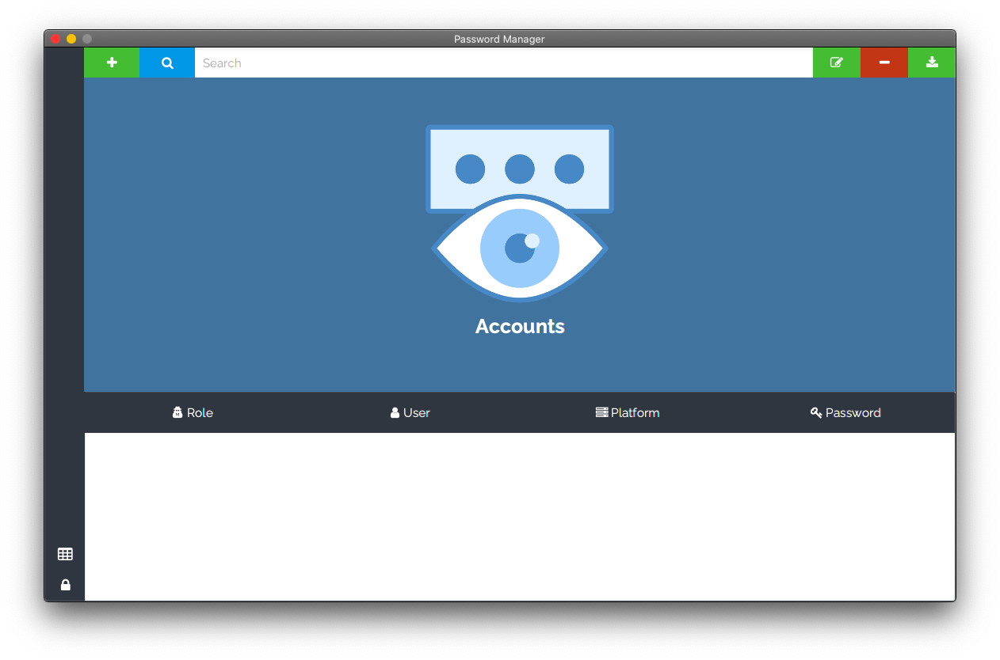

# About

Password manager a simple way to stored password using encryptation algorithm AES.

## Screenshots



## Requirements

* SBT 1.5.5+
* Java 11

## Getting the code
```
git clone https://github.com/marcos-ro/password-manager
cd password-manager
sbt run
```

## LICENSE
```
password-manager: Simple way to stored your password accounts
Copyright (C) 2021 marcos-ro <marcosroropeza@protonmail.com>

This program is free software: you can redistribute it and/or modify
it under the terms of the GNU General Public License as published by
the Free Software Foundation, either version 3 of the License, or
(at your option) any later version.

This program is distributed in the hope that it will be useful,
but WITHOUT ANY WARRANTY; without even the implied warranty of
MERCHANTABILITY or FITNESS FOR A PARTICULAR PURPOSE.  See the
GNU General Public License for more details.

You should have received a copy of the GNU General Public License
along with this program.  If not, see <https://www.gnu.org/licenses/>.
```
